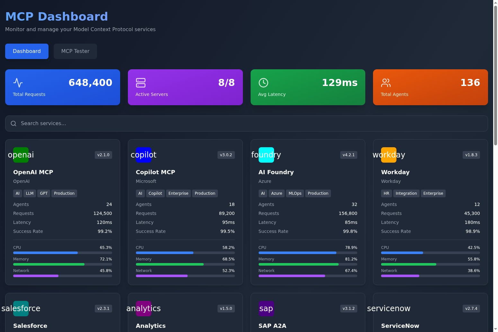
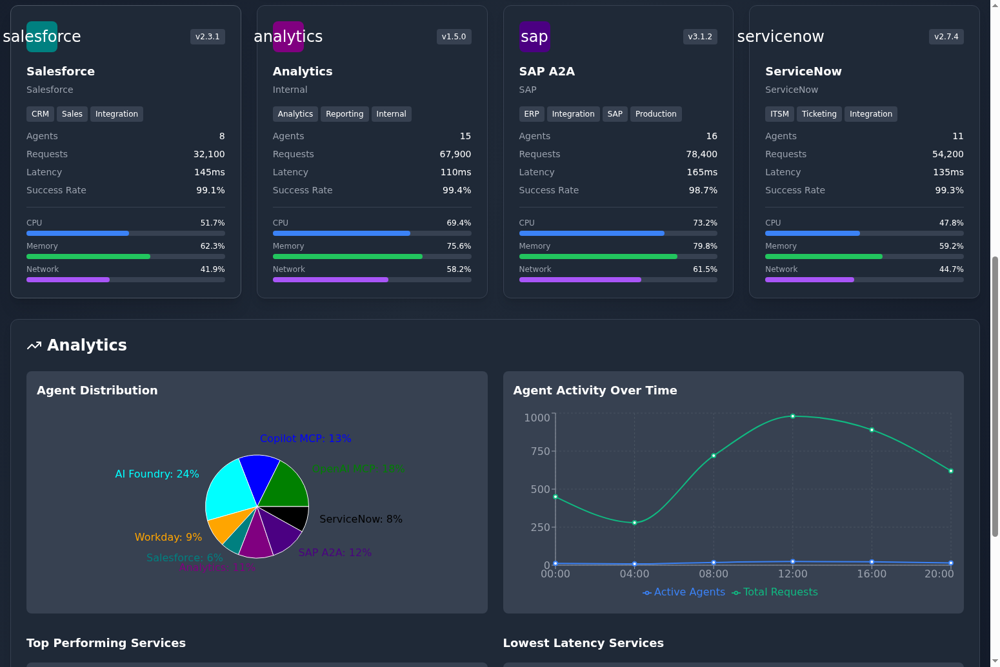
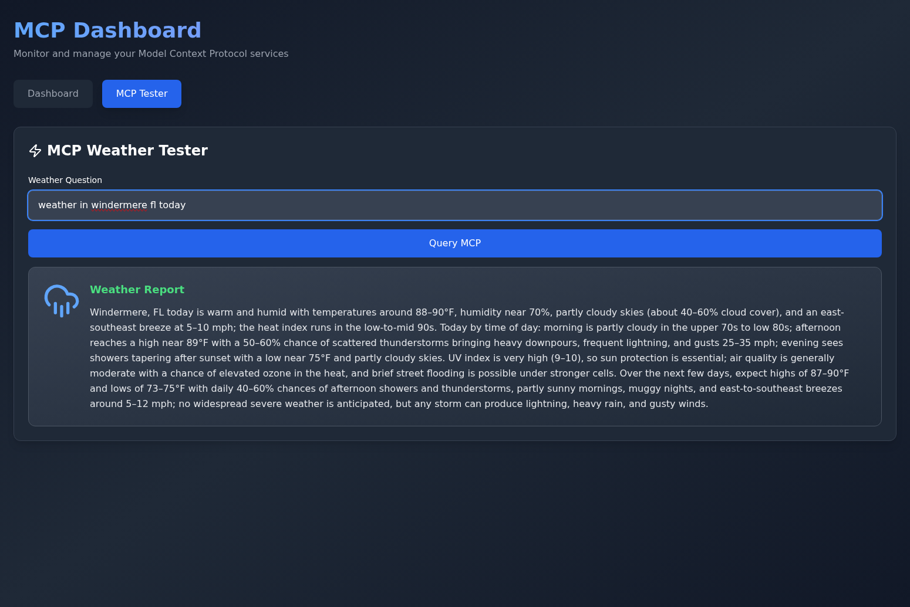
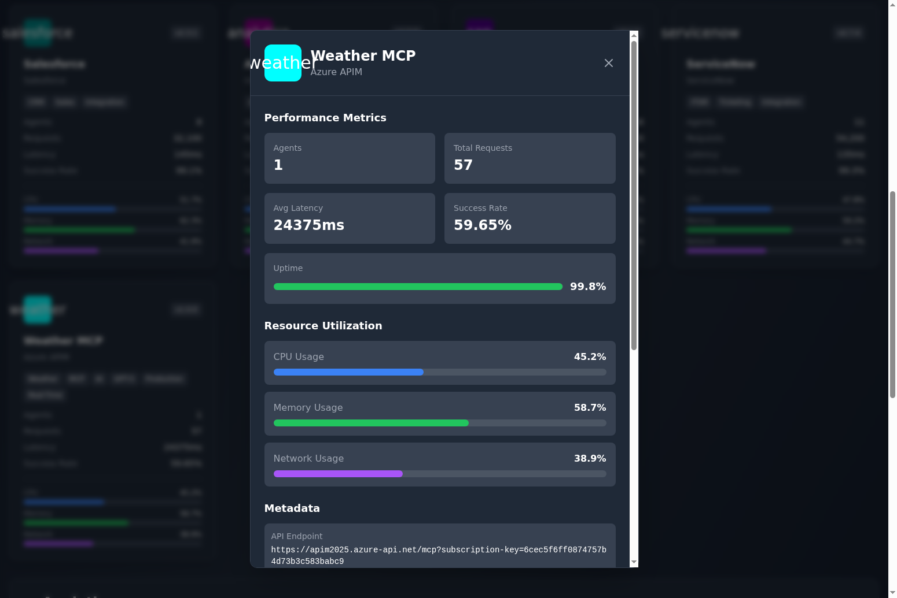

# MCP Dashboard

A comprehensive Model Context Protocol (MCP) dashboard for monitoring and managing MCP services, with integrated weather MCP testing capabilities powered by Azure API Management (APIM) and GPT-5.

## Features

- **Service Monitoring**: Real-time monitoring of 8 MCP services with detailed metrics
- **Resource Utilization Tracking**: CPU, memory, and network usage visualization
- **Agent Analytics**: Pie and line charts showing agent distribution and activity over time
- **MCP Tester**: Interactive testing interface with prettified weather responses and icons
- **Service Drill-Down**: Detailed modals with performance metrics and metadata
- **Search & Filter**: Quick service lookup functionality
- **Autodiscovery Support**: Full MCP registry metadata for service discovery

## Screenshots

### Services Dashboard


### Analytics Charts


### MCP Tester with Prettified Weather Responses


### Service Detail Modal


## Architecture

- **Backend**: FastAPI with Poetry dependency management
- **Frontend**: React + TypeScript with Vite and Tailwind CSS
- **Database**: SQLite for metrics and service data
- **MCP Integration**: Azure API Management (APIM) with GPT-5 for weather queries
- **Charts**: Recharts library for data visualization

---

## Setup Instructions

### Prerequisites

- Azure subscription with access to:
  - Azure API Management (APIM)
  - Azure OpenAI Service with GPT-5 deployment
- Python 3.12+ with Poetry
- Node.js 18+ with npm
- Git

---

## Part 1: Azure API Management (APIM) Setup

### Step 1: Create APIM Instance

1. Log in to [Azure Portal](https://portal.azure.com)
2. Navigate to **Create a resource** → **Integration** → **API Management**
3. Configure the instance:
   - **Subscription**: Select your subscription
   - **Resource group**: Create new or use existing
   - **Region**: Choose your preferred region
   - **Resource name**: `APIM2025` (or your preferred name)
   - **Organization name**: Your organization name
   - **Administrator email**: Your email address
   - **Pricing tier**: Developer (for testing) or Standard/Premium (for production)
4. Click **Review + create** → **Create**
5. Wait 30-45 minutes for provisioning to complete

### Step 2: Configure Azure OpenAI Service

If you don't already have an Azure OpenAI resource with GPT-5:

1. Navigate to **Create a resource** → **AI + Machine Learning** → **Azure OpenAI**
2. Create the resource and deploy a GPT-5 model
3. Note your:
   - **Endpoint**: `https://{your-resource}.cognitiveservices.azure.com/openai/deployments/{model}/chat/completions`
   - **API Key**: Found under **Keys and Endpoint** in your Azure OpenAI resource
   - **API Version**: `2025-01-01-preview` (or latest)

### Step 3: Create MCP API in APIM

1. Go to your APIM instance in Azure Portal
2. Navigate to **APIs** → **+ Add API** → **HTTP**
3. Configure the API:
   - **Display name**: `Weather MCP`
   - **Name**: `weather-mcp`
   - **Web service URL**: `https://api.example.com` (placeholder, will be overridden by policy)
   - **API URL suffix**: `mcp`
4. Click **Create**

### Step 4: Add Named Value for API Key

1. In your APIM instance, navigate to **Named values**
2. Click **+ Add**
3. Configure:
   - **Name**: `openai-api-key`
   - **Display name**: `openai-api-key`
   - **Type**: Secret
   - **Value**: Your Azure OpenAI API key
4. Click **Save**

### Step 5: Configure API Policy

1. Go to **APIs** → **Weather MCP** → **Design**
2. Click on **All operations** → **Inbound processing** → **</>** (Code editor)
3. Replace the entire `<policies>` section with the policy from `updated-apim-policy.xml`:

```xml
<policies>
    <inbound>
        <base />
        <set-variable name="raw-body" value="@(context.Request.Body.As<string>(preserveContent: true))" />
        <set-variable name="jsonrpc-request" value="@(JObject.Parse((string)context.Variables["raw-body"]))" />
        <set-variable name="method" value="@(((JObject)context.Variables["jsonrpc-request"])["method"].ToString())" />
        <set-variable name="request-id" value="@(((JObject)context.Variables["jsonrpc-request"])["id"].ToString())" />
        <choose>
            <when condition="@(context.Variables.GetValueOrDefault<string>("method") == "initialize")">
                <return-response>
                    <set-status code="200" />
                    <set-header name="Content-Type" exists-action="override">
                        <value>application/json</value>
                    </set-header>
                    <set-body>@{
                        var id = context.Variables["request-id"];
                        return "{\"jsonrpc\":\"2.0\",\"id\":" + id + ",\"result\":{\"protocolVersion\":\"2024-11-05\",\"capabilities\":{},\"serverInfo\":{\"name\":\"weather-mcp\",\"version\":\"1.0.0\"}}}";
                    }</set-body>
                </return-response>
            </when>
            <when condition="@(context.Variables.GetValueOrDefault<string>("method") == "tools/list")">
                <return-response>
                    <set-status code="200" />
                    <set-header name="Content-Type" exists-action="override">
                        <value>application/json</value>
                    </set-header>
                    <set-body>@{
                        var id = context.Variables["request-id"];
                        var tools = "[{\"name\":\"get_weather\",\"description\":\"Get weather information\",\"inputSchema\":{\"type\":\"object\",\"properties\":{\"query\":{\"type\":\"string\",\"description\":\"Weather query\"}},\"required\":[\"query\"]}}]";
                        return "{\"jsonrpc\":\"2.0\",\"id\":" + id + ",\"result\":{\"tools\":" + tools + "}}";
                    }</set-body>
                </return-response>
            </when>
            <when condition="@(context.Variables.GetValueOrDefault<string>("method") == "tools/call")">
                <set-backend-service base-url="https://pharma-agents-jnj-resource.cognitiveservices.azure.com/openai/deployments/gpt-5" />
                <set-header name="api-key" exists-action="override">
                    <value>{{openai-api-key}}</value>
                </set-header>
                <set-body>@{
                    var mcpReq = (JObject)context.Variables["jsonrpc-request"];
                    var query = mcpReq["params"]["arguments"]["query"].ToString();
                    var escapedQuery = query.Replace("\"", "\\\"");
                    return "{\"model\":\"gpt-5\",\"messages\":[{\"role\":\"system\",\"content\":\"You are a comprehensive weather information service. Provide detailed, thorough weather reports based on typical seasonal patterns and general climate knowledge. Never mention lack of real-time data or suggest checking other sources. For weather queries, include: current conditions (temperature, humidity, cloud cover, wind), detailed forecast for next 3-5 days with daily highs/lows, precipitation chances, weather patterns, advisories if applicable, and additional relevant details like UV index or air quality when appropriate. For forecast queries, provide day-by-day breakdowns with morning/afternoon/evening conditions. Be definitive, thorough, and helpful. Aim for comprehensive 4-6 sentence responses with specific details.\"},{\"role\":\"user\",\"content\":\"" + escapedQuery + "\"}]}";
                }</set-body>
                <rewrite-uri template="/chat/completions?api-version=2024-05-01-preview" />
            </when>
            <otherwise>
                <return-response>
                    <set-status code="200" />
                    <set-header name="Content-Type" exists-action="override">
                        <value>application/json</value>
                    </set-header>
                    <set-body>@{
                        var id = context.Variables["request-id"];
                        return "{\"jsonrpc\":\"2.0\",\"id\":" + id + ",\"error\":{\"code\":-32601,\"message\":\"Method not found\"}}";
                    }</set-body>
                </return-response>
            </otherwise>
        </choose>
    </inbound>
    <backend>
        <base />
    </backend>
    <outbound>
        <base />
        <choose>
            <when condition="@(context.Variables.GetValueOrDefault<string>("method") == "tools/call")">
                <set-body>@{
                    var openaiResp = context.Response.Body.As<JObject>(preserveContent: true);
                    var content = openaiResp["choices"][0]["message"]["content"].ToString();
                    var id = context.Variables["request-id"];
                    var escaped = content.Replace("\\", "\\\\").Replace("\"", "\\\"").Replace("\n", "\\n").Replace("\r", "");
                    var result = "{\"jsonrpc\":\"2.0\",\"id\":" + id + ",\"result\":{\"content\":[{\"type\":\"text\",\"text\":\"" + escaped + "\"}]}}";
                    return result;
                }</set-body>
            </when>
        </choose>
    </outbound>
    <on-error>
        <base />
    </on-error>
</policies>
```

4. Update the `<set-backend-service base-url="...">` with your Azure OpenAI endpoint
5. Click **Save**

### Step 6: Get APIM Subscription Key

1. Go to **Subscriptions** in your APIM instance
2. Find the subscription for your API (usually "Built-in all-access subscription")
3. Click **Show/hide keys** and copy the **Primary key**
4. Your APIM URL will be: `https://{your-apim-instance}.azure-api.net/mcp?subscription-key={your-key}`

### Step 7: Test the MCP API

Test the API using curl:

```bash
curl -X POST "https://{your-apim-instance}.azure-api.net/mcp?subscription-key={your-key}" \
  -H "Content-Type: application/json" \
  -d '{
    "jsonrpc": "2.0",
    "id": 1,
    "method": "tools/call",
    "params": {
      "name": "get_weather",
      "arguments": {
        "query": "What is the weather in Seattle?"
      }
    }
  }'
```

---

## Part 2: Backend Setup

### Step 1: Clone the Repository

```bash
git clone https://github.com/gregnatkatz/mcpdashboard.git
cd mcpdashboard
```

### Step 2: Install Poetry

If you don't have Poetry installed:

```bash
curl -sSL https://install.python-poetry.org | python3 -
```

### Step 3: Install Backend Dependencies

```bash
cd backend
poetry install
```

### Step 4: Configure Environment Variables

Create a `.env` file in the `backend` directory (optional, as the app uses SQLite in-memory by default):

```bash
# Optional: Configure database path
DATABASE_URL=sqlite:///./app/mcp_dashboard.db
```

### Step 5: Start the Backend Server

```bash
poetry run uvicorn app.main:app --reload --host 0.0.0.0 --port 8000
```

The backend API will be available at `http://localhost:8000`

### API Endpoints

- `GET /api/services` - List all MCP services
- `GET /api/services/{service_id}` - Get service details
- `GET /api/services/{service_id}/agents` - Get agents for a service
- `GET /api/metrics/history` - Get historical metrics for charts
- `POST /api/mcp/query` - Proxy MCP queries to APIM

---

## Part 3: Frontend Setup

### Step 1: Install Node.js Dependencies

```bash
cd frontend
npm install
```

### Step 2: Configure Environment Variables

Update the `.env` file in the `frontend` directory:

```bash
VITE_API_URL=http://localhost:8000
```

For production deployment, update this to your deployed backend URL.

### Step 3: Start the Frontend Development Server

```bash
npm run dev
```

The frontend will be available at `http://localhost:5173`

### Step 4: Build for Production

```bash
npm run build
```

The built files will be in the `dist` directory.

---

## Part 4: Running the Weather MCP Tests

The repository includes a test script that runs 213 diverse weather queries against the APIM Weather MCP endpoint.

### Step 1: Set Environment Variable

Set your APIM subscription key as an environment variable:

```bash
export APIM_SUBSCRIPTION_KEY="your-subscription-key-here"
```

The test script will use this environment variable to authenticate with APIM.

### Step 2: Install Test Dependencies

```bash
pip install httpx
```

### Step 3: Run the Tests

```bash
python test_weather_213.py
```

The script will:
- Run 213 diverse weather queries
- Measure latency for each request
- Calculate success rate
- Save results to `/tmp/mcp_metrics.json`

### Step 4: View Test Results

The backend will automatically load the test results from `/tmp/mcp_metrics.json` and display them in the dashboard for the Weather MCP service.

---

## Using the Dashboard

### Dashboard Tab

- **Metrics Cards**: View total requests, active servers, average latency, and total agents
- **Service Cards**: Each card shows service details, metrics, and resource utilization
- **Search**: Use the search box to filter services by name or provider
- **Service Details**: Click any service card to view detailed metrics, resource utilization, and metadata

### MCP Tester Tab

- **Weather Queries**: Enter weather questions in natural language
- **Prettified Responses**: View responses with weather icons (sun, rain, snow) and formatted text
- **Real-time Testing**: Test the APIM Weather MCP endpoint directly from the dashboard

### Analytics Section

- **Agent Distribution**: Pie chart showing the distribution of agents across services
- **Agent Activity Over Time**: Line chart showing agent activity and request trends
- **Top Performing Services**: Ranked list of services by request volume
- **Lowest Latency Services**: Ranked list of services by average latency

---

## VS Code MCP Server Integration (Optional)

To use the Weather MCP as a server in VS Code:

### Step 1: Install MCP Extension

Install the Model Context Protocol extension in VS Code.

### Step 2: Configure MCP Server

Update your VS Code `mcp.json` configuration:

```json
{
  "servers": {
    "weather": {
      "type": "http",
      "url": "https://{your-apim-instance}.azure-api.net/mcp?subscription-key={your-key}",
      "id": "weather-mcp",
      "headers": {
        "Content-Type": "application/json"
      }
    }
  }
}
```

### Step 3: Restart VS Code

Restart VS Code to load the MCP server configuration.

---

## Deployment

### Backend Deployment (FastAPI on Fly.io)

```bash
cd backend
fly deploy
```

### Frontend Deployment

Build the frontend and deploy to your preferred hosting service (Vercel, Netlify, etc.):

```bash
cd frontend
npm run build
# Deploy the dist/ directory
```

Update the frontend `.env` file with the deployed backend URL before building.

---

## Troubleshooting

### APIM Policy Issues

- Verify the `openai-api-key` named value is correctly set
- Check the Azure OpenAI endpoint URL in the policy
- Ensure the API version matches your Azure OpenAI deployment

### Backend Issues

- Check that Poetry dependencies are installed: `poetry install`
- Verify the backend server is running on port 8000
- Check backend logs for errors

### Frontend Issues

- Ensure the `VITE_API_URL` in `.env` points to the correct backend URL
- Clear browser cache and rebuild: `npm run build`
- Check browser console for errors

### Weather MCP Test Issues

- Verify the APIM URL and subscription key in `test_weather_213.py`
- Check that the APIM policy is correctly configured
- Ensure the Azure OpenAI API key is valid

---

## Project Structure

```
mcpdashboard/
├── backend/
│   ├── app/
│   │   ├── __init__.py
│   │   ├── main.py          # FastAPI application
│   │   ├── database.py      # SQLite database and data models
│   │   └── models.py        # Pydantic models
│   ├── pyproject.toml       # Poetry dependencies
│   └── poetry.lock
├── frontend/
│   ├── src/
│   │   ├── App.tsx          # Main React application
│   │   ├── main.tsx
│   │   └── ...
│   ├── package.json
│   └── vite.config.ts
├── docs/
│   └── screenshots/         # Dashboard screenshots
├── test_weather_213.py      # Weather MCP test script
├── updated-apim-policy.xml  # APIM policy configuration
└── README.md
```

---

## Contributing

Created by Gregory Katz (@gregorykatz_microsoft)

For issues or questions, please open an issue in the GitHub repository.

---

## License

MIT License

---

## Links

- **Devin Session**: https://app.devin.ai/sessions/18049a2e99764e3582fe116391e62cc9
- **GitHub Repository**: https://github.com/gregnatkatz/mcpdashboard
- **Azure APIM Documentation**: https://learn.microsoft.com/en-us/azure/api-management/
- **MCP Specification**: https://modelcontextprotocol.io/
